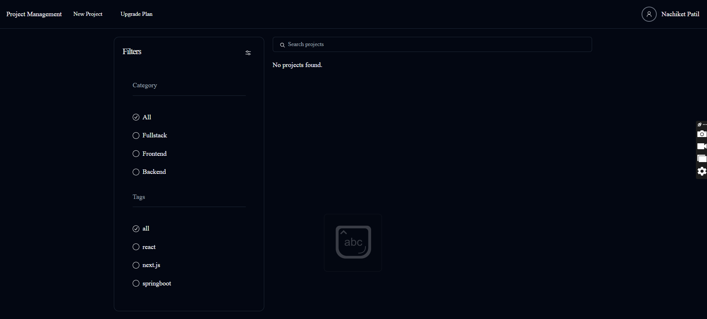
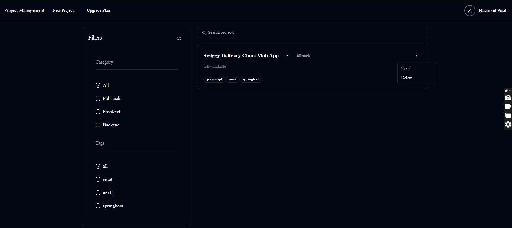
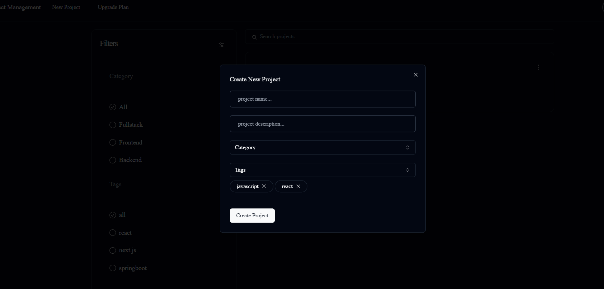
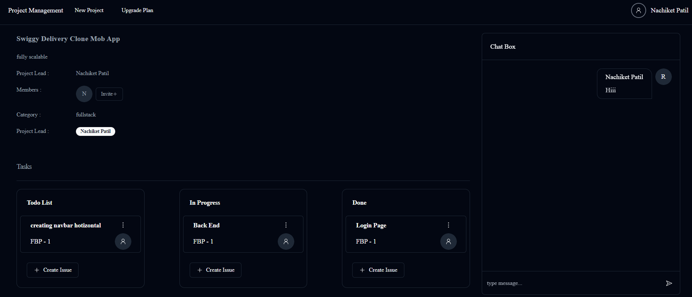
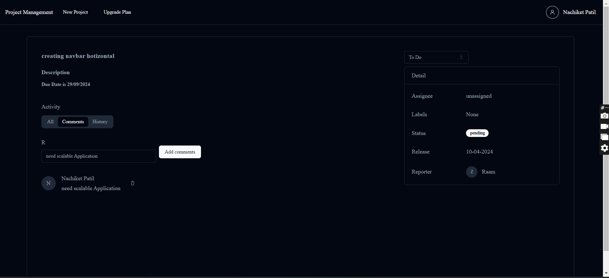
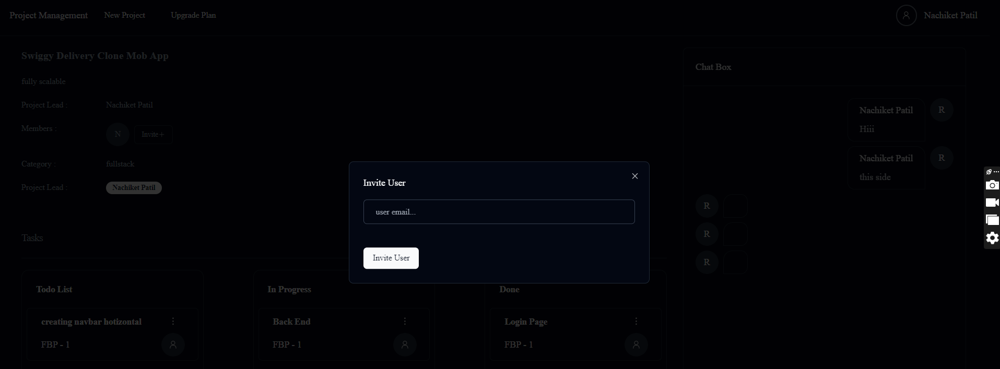
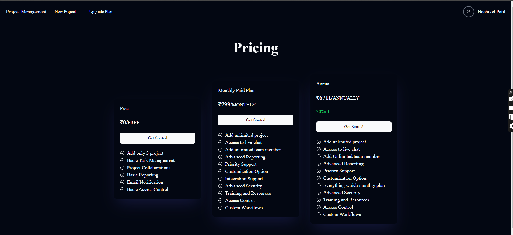
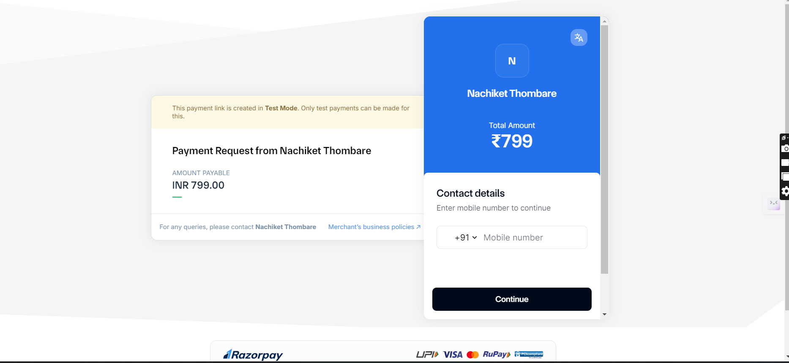
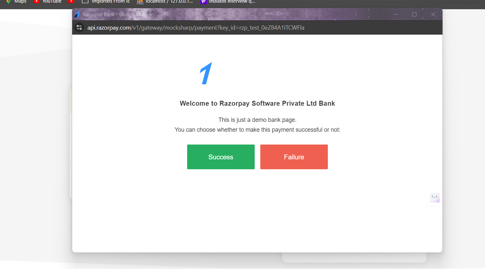
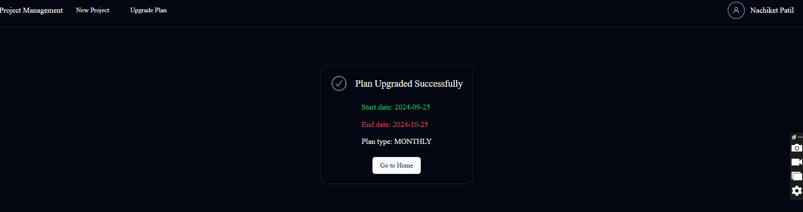

## GrowSpace ToDo Application
This project is a simple ToDo application with a Java backend built using Spring Boot, and a frontend developed using HTML, CSS, and JavaScript. The backend provides RESTful APIs for managing ToDo items, while the frontend offers a user-friendly interface for interacting with the ToDo list.

